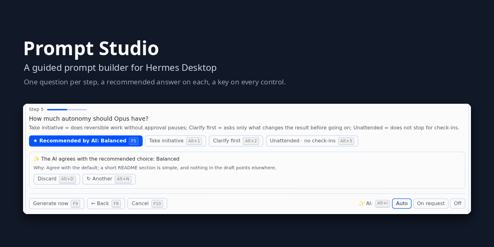
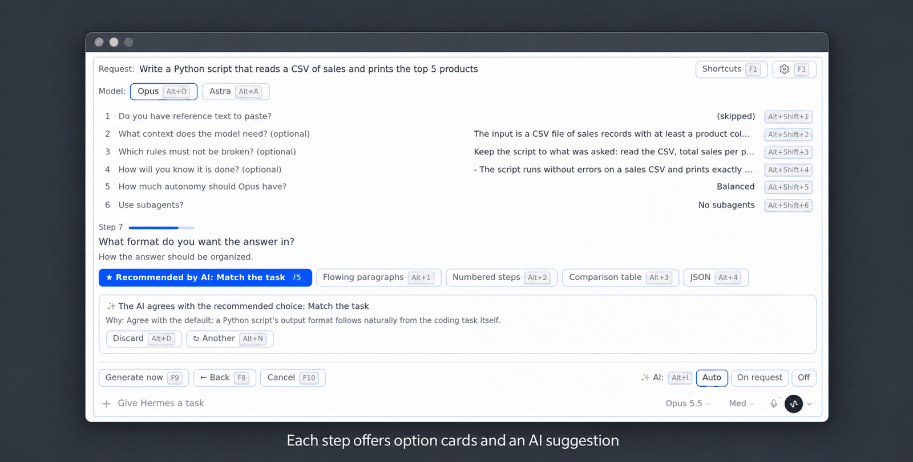
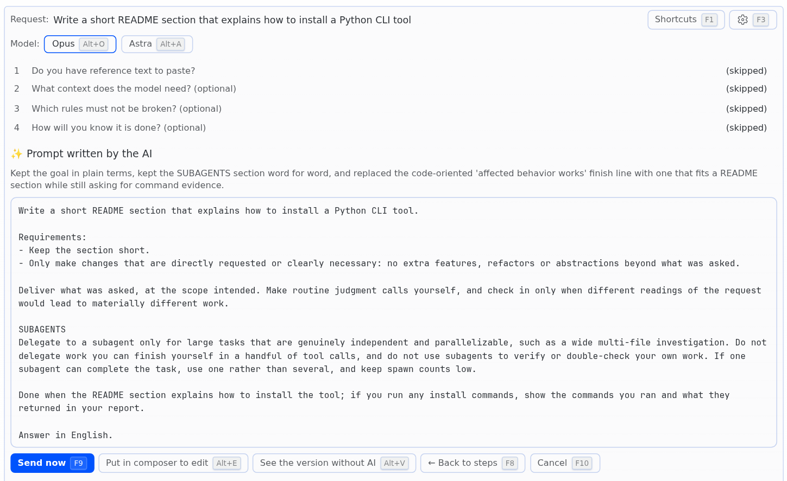
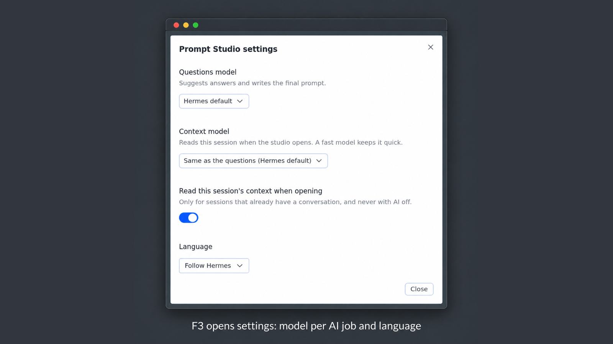

# Prompt Studio



Prompt Studio is a Hermes Desktop plugin that turns a rough request into a well-built prompt for
**Claude Opus 5.5**, **Claude Sonnet 5.5** or **GPT-6 Astra**. It asks the few questions that change the result, one step
at a time, with a recommended answer on each. Then it writes the prompt and places it in the message field for you to
review. It never sends anything on its own.

Each step can get a suggestion from an auxiliary AI model, and at the end that model can polish the prompt from your
answers. When the AI is off, slow or unavailable, you still get a complete prompt, built locally by the plugin's own
engine for the chosen model. The three engines were written for this plugin from the official Anthropic and OpenAI
documentation ([how each prompt is built](docs/MODELS.md)).

## Requirements

- Hermes 0.21.5 or later (`requires_hermes: ">=0.21.5"` in `plugin.yaml`), with Hermes Desktop 0.21.5 or later.
  The Studio reads and writes the message field only through the Desktop SDK's `host.composer`, added in 0.21.5;
  on an older Desktop it does not open and asks you to update Hermes.
- The `hermes` CLI on `PATH`, or its path in `HERMES_BIN`.
- Python 3.12 or later for the installer (set `PYTHON_BIN` to pick an interpreter).
- **Platforms:** tested only on Linux (Linux Mint). Windows and macOS are not tested; on Windows install with
  `hermes plugins install` (below), as `install.sh` is a bash script.

## Install

Install it with the Hermes plugin command, run on the machine where the Hermes backend runs:

```bash
hermes plugins install bwoliveira/prompt-studio --enable
```

Without `--enable`, Hermes asks `Enable 'prompt-studio' now? [y/N]` in an interactive terminal (otherwise it stays
disabled). To pin a version, give a full 40-character commit SHA (no tags, branches or short SHAs):
`hermes plugins install bwoliveira/prompt-studio --ref <40-character-commit-sha>`.

Update later with `hermes plugins update prompt-studio`, then close and reopen Hermes Desktop so the backend mounts the
routes and Desktop picks up the desktop half. **Capabilities → Plugins** should show *Prompt Studio* enabled (commands
from the official [plugin guide](https://hermes-agent.nousresearch.com/docs/user-guide/features/plugins)).

**From a checkout:** `./install.sh` installs from a local clone (`--profile <name>` for a named profile, `--home <path>`
for another Hermes home). It is safe to re-run; run it again after `git pull` to update. No build or npm is needed:
`desktop/plugin.js` is committed.

**Remote backend** (Desktop connected over SSH or a URL): run the install on the backend host as above. Hermes
Desktop copies the desktop half only from the plugins folder of the Hermes home on the machine where the app runs;
it never fetches it from a remote backend. So put the desktop half on the app machine from a checkout:

```bash
scripts/push-desktop.sh me@my-laptop              # user@machine or an ~/.ssh/config alias
scripts/push-desktop.sh me@my-laptop --dry-run    # print the plan, open no connection
```

The app machine needs `ssh` and a POSIX login shell (Linux, macOS). The script copies `desktop/plugin.js` to
`~/.hermes/desktop-plugins/prompt-studio/plugin.js` there (`--dir` names another `desktop-plugins` folder) with one `ssh` call and
checks a checksum before it says `[OK]`; repeat after each update. If the app machine also has a local install, the
script refuses (Desktop would overwrite the pushed file): `--replace-managed` converts that folder, but only after you
close Hermes Desktop on the app machine. Every option, the Windows path and the managed-folder rules are in
[docs/REMOTE-INSTALL.md](docs/REMOTE-INSTALL.md).

## Usage



1. Write your request in the message field and press **F4**, or click **✨ Prompt Studio**, or run
   *Prompt Studio* from the command palette.
2. Pick the model (**Opus**, **Astra** or **Sonnet**). The first choice follows the session's model: Sonnet for a
   Sonnet, Astra for an OpenAI model, Opus otherwise.
3. Answer the steps. Depending on the request they cover what you want to receive, reference text to paste (and where
   it came from), context, rules that cannot be broken, how you will know it is done, interface patterns to avoid
   (Opus and Sonnet, code work), autonomy, subagents, an example of the result, format and length.
   Every step has a recommended choice. You can skip, go back, or edit any earlier answer.
4. Generate. The preview shows the prompt; switch between the AI version and the version built without AI,
   then **Send now** (F9) to send it at once, or **Put in composer to edit** (Alt+E) to place it in the message field and edit it first.



The AI mode (Auto, On request, Off) decides when step suggestions are requested. The interface is in English or
Brazilian Portuguese: the Studio follows the Hermes language, and Settings (F3) can fix it to Português or English,
which also sets the language of the questions and of the AI's notes. The prompt follows the language of your request.

## Keyboard

Every control shows its key, and keys work with the cursor in the answer field. The table is generated from the
plugin's shortcut map; the Studio's own **F1** list shows the same keys.

<!-- shortcut-table:start -->
| Linux and Windows | Mac | Action |
|---|---|---|
| F4, or Ctrl+Shift+E | F4, or ⌘⇧E | Open Prompt Studio (from the message field) |
| F1 | F1 | Show or hide this list |
| F3 | F3 | Settings: models, session context, language |
| F5 / Alt+Y | F5 / ⌥Y | Accept the recommended choice (in Auto mode, the AI pick) or confirm what you typed |
| F6 / Alt+K | F6 / ⌥K | Skip, I don't have one, or use the default |
| F7 / Alt+L | F7 / ⌥L | Use the AI text or the recommended one it offers |
| F8 / Alt+B | F8 / ⌥B | Back, undo the edit, or back to the steps |
| F9 / Alt+G | F9 / ⌥G | Generate the prompt; on the preview, send it now |
| F10 / Alt+X | F10 / ⌥X | Close and return the draft |
| Alt+1…9 | ⌥1…9 | Pick an option |
| Alt+Shift+1…9 | ⌥⇧1…9 | Edit an answered step |
| Alt+S | ⌥S | Ask the AI, or try again |
| Alt+N | ⌥N | Another suggestion |
| Alt+D | ⌥D | Discard the suggestion, or stop the AI |
| Alt+M | ⌥M | Improve my text |
| Alt+C | ⌥C | Paste text |
| Alt+O / Alt+A / Alt+T | ⌥O / ⌥A / ⌥T | Model: Opus, Astra or Sonnet |
| Alt+I | ⌥I | Next AI help mode |
| Alt+V | ⌥V | Other version in the preview |
| Alt+E | ⌥E | Put the prompt in the composer to edit before sending |
<!-- shortcut-table:end -->

- **Open:** F4 opens the Studio from the message field. **Ctrl+Shift+E** (**⌘⇧E** on a Mac) is a Hermes Desktop
  key the plugin adds: it appears under Keybinds in Desktop's settings, where you can reassign it, and acts like F4.
  The command palette entry *Prompt Studio* opens it too.
- **No F-key needed:** F5 to F10 each have an Alt+letter twin (the table shows both). The letters skip E, I, N and U,
  the Option dead keys on a Mac. F1 and F3 are also buttons.
- **Never captured:** the Studio never takes Enter, Alt+Enter, Tab, Esc or any chord with Ctrl or Super. Inside its
  answer field, Enter makes a new line. To accept without F5, press Enter on the focused recommended button.
- **Mac:** keys show as ⌥ and ⇧, and F-keys as plain F4, F9 and so on. With ⌘⇧E to open and the Option twins, you
  never need to press fn. Alt shortcuts follow the physical key, so ⌥E, ⌥N and ⌥I work although macOS would start an
  accent there.
- **Alt:** either Alt key works, except where the right Alt is AltGr. Alt+digits follow the physical number row.
- **Behind dialogs and menus:** with a Hermes dialog, menu or palette in front, the Studio's keys do nothing.
- **Screen readers:** the model and AI-mode switches are groups of pressed/not-pressed buttons that change only on
  Enter, Space or a click, never on an arrow key. Edit buttons name the question and its current answer, the preview
  is a named region, and new steps, the AI status and the preview note are announced.

## Configuration



Nothing needs setting up: with no model picked, the Studio uses your Hermes default model. **Settings (F3)** picks one
model for the questions and the final polish, one for reading the session context (a fast model keeps opening quick),
whether to read it when opening, and the language. Each model pick has a provider, a model and a reasoning level; the
picks live in the plugin storage and the plugin never edits `config.yaml`.

Without a pick, the suggestions and the final polish use the auxiliary task `prompt_studio`. Pick its model in the CLI
(`hermes model` → *Configure auxiliary models* → **Prompt Studio**) or in `config.yaml`:

```yaml
auxiliary:
  prompt_studio:
    provider: anthropic
    model: claude-opus-5-5
    reasoning_effort: low
    timeout: 20
```

`timeout` applies to each step's suggestion; the final polish always gets its own 45 s budget. If `prompt_studio`
pins no provider or model, the task follows the main model. Provider errors (401, 402, 403, 400, 429, timeouts), Command
Code (Claude models need the provider `commandcode-anthropic`), the effort and `max_tokens` rules and the
`hermes config set` warning are in [docs/CONFIGURATION.md](docs/CONFIGURATION.md); the REST routes in
[docs/CONTRACT.md](docs/CONTRACT.md).

## Troubleshooting

- **F4 does nothing:** the plugin's own Desktop code listens for the key, so if it did not load, nothing does. In
  **Capabilities → Plugins**, a red **failed** badge on Prompt Studio means the Desktop half did not load, and the error
  is shown under it (Desktop also shows a *Plugin "…" failed to load* toast at startup). Update the plugin
  (`hermes plugins update prompt-studio`) and Hermes to the latest stable release, then reopen Hermes Desktop. Prompt
  Studio 1.8.0 and later need Hermes Desktop 0.21.5 or newer; with a remote backend, push the Desktop half again.
- **The Studio asks you to update:** a Desktop older than 0.21.5 has no `host.composer`, so update Hermes Desktop. If
  it says Hermes changed in a way this version does not support, update the plugin. Then reopen the app.
- **Attachments:** files attached in the message field stay there while the Studio is open. **Put in composer to
  edit** (Alt+E) keeps them with the prompt; **Send now** (F9) sends only the text, and the preview says so in red.

## Privacy and security

- **Session context is limited and optional.** When the Studio opens in a session that already has a conversation, the
  context model reads its last eight user and assistant turns (tool output and reasoning are left out, secrets are
  masked) and writes a short summary. The summary only helps the step suggestions; it never goes into the final
  prompt. Nothing is read in a new session, with the AI off, or with that option turned off in Settings.
- **Pasted text is escaped** so it cannot close its tags, and it is marked as data, not instructions.
- **No secrets stored.** The plugin keeps only its preferences in the plugin storage, declares no environment
  variables and never edits `config.yaml`. Provider error text is not shown; errors surface as codes.
- **Nothing is sent for you.** The finished prompt is placed in the message field; you decide whether to send it.

## Contributing

[CONTRIBUTING.md](CONTRIBUTING.md) (setup, tests, review flow), [docs/DESKTOP-DEV.md](docs/DESKTOP-DEV.md),
[docs/CONTRACT.md](docs/CONTRACT.md), [docs/adr/](docs/adr/), [CONTEXT.md](CONTEXT.md) and [CHANGELOG.md](CHANGELOG.md).
Building or testing from a checkout needs Node 22.13 or later and `npm ci` once.

## Credits

The idea for Prompt Studio came from:

- the [grill-tab](https://github.com/thanhan-a17/grill-tab) repository by thanhan-a17, which asks one
  decision at a time and turns the answers into a brief;
- two prompt-builder sites: a Claude Opus 5.5 builder ([dreamy-mudra-cj75.here.now](https://dreamy-mudra-cj75.here.now/))
  and a GPT-6 Astra builder ([sable-valley-eyrb.here.now](https://sable-valley-eyrb.here.now/), MIT source at
  [Eddienews/astra-prompt-builder](https://github.com/Eddienews/astra-prompt-builder)).

Prompt Studio's prompt engines were written from scratch from the official Anthropic and OpenAI
documentation and contain no code from those sites. Parts of the packaging and backend scaffolding are
derived from grill-tab, so `LICENSE` keeps its MIT copyright notice.

## License

MIT. See `LICENSE`.
